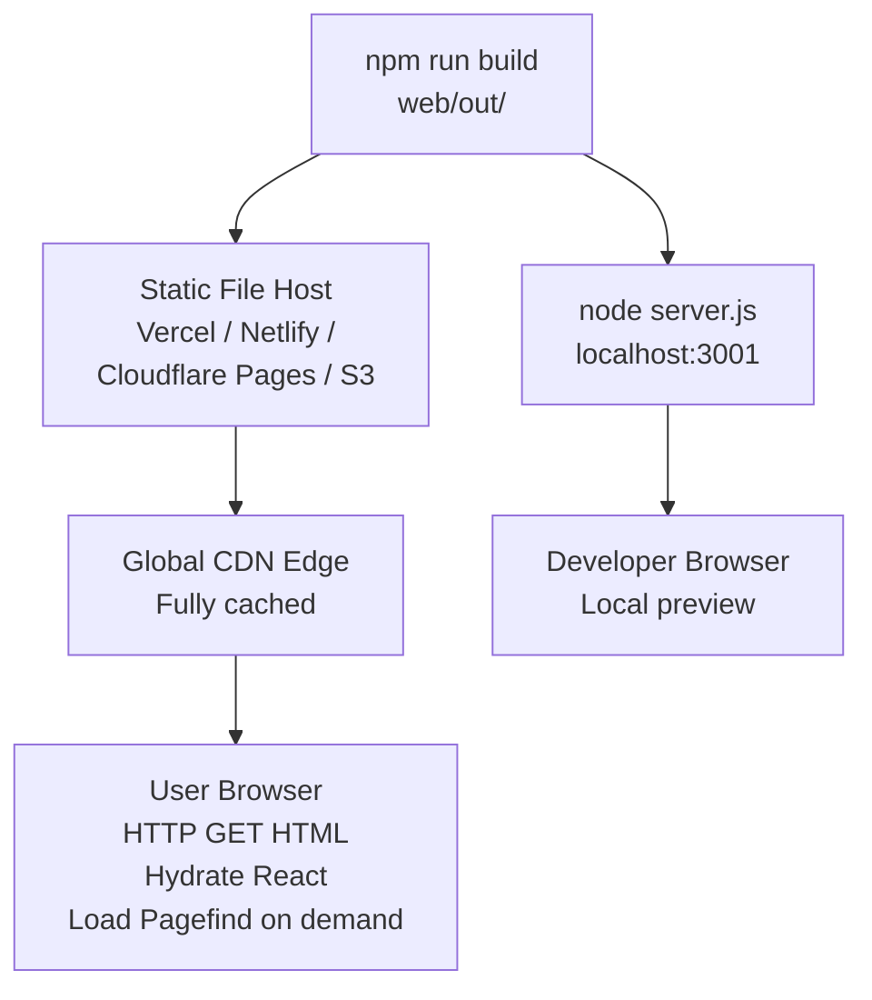

# Architecture Overview Diagram

The complete system architecture of Project UIL.

```mermaid
graph TB
    subgraph RESEARCH["Research Corpus Layer"]
        DOCX_F["Human Friction\n.docx Volumes\n/atlas/Human-Frictions/"]
        DOCX_P["Behavioral Pattern\n.docx Files\n/atlas/Patterns/"]
        DOCX_R["Registry\n.docx Files\n/atlas/Registries/"]
        DOCX_M["Metrics\n.docx Files\n/atlas/metrics/"]
        DOCX_D["Governance Docs\n.docx Files\n/docs/"]
    end

    subgraph MIGRATION["Migration Layer — tools/migration/"]
        MIG_F["migrate-full.js\nMammoth + Turndown + js-yaml"]
        MIG_R["migrate-registries.js\nMammoth (HTML preserved)"]
        MIG_M["migrate-metrics-html.js\nMammoth (HTML preserved)"]
        MIG_D["migrate-docs.js\nMammoth + Markdown manifest"]
    end

    subgraph CONTENT["Content Database — web/content/"]
        MD_F["atlas/AU/AU-001.md\natlas/FF/FF-023.md\n~375 friction files"]
        MD_P["patterns/PAT-001.md\npatterns/PAT-064.md\n~64 pattern files"]
        MD_R["registries/APID-Registry.md\nregistries/Category-Registry.md\nregistries/Pattern-Registry.md"]
        MD_M["metrics/human-friction-metrics.md\nmetrics/pattern-metrics.md"]
        MD_D["docs/constitution.md\ndocs/publishing-manual.md\n~19 doc files"]
    end

    subgraph DATA_LAYER["Data Access Layer — web/src/lib/"]
        API["api.ts\ngetFrictions()\ngetPatterns()\ngetCategories()\ngetDocs()"]
        REG_PARSER["registryParser.ts\nparseRegistryDocument()\nCheerio DOM"]
        TBL_PARSER["tableParser.ts\nextractTablesFromHtml()\nRegex-based"]
    end

    subgraph BUILD["Next.js Build — web/src/app/"]
        SERVER["Server Components\nPage files\ngenerateStaticParams()"]
        MARKED["marked.parse()\nMarkdown → HTML"]
        MATTER["gray-matter\nYAML → Object"]
    end

    subgraph OUTPUT["Build Output — web/out/"]
        HTML["Static HTML Pages\nindex.html\natlas/au-001/index.html\npatterns/pat-001/index.html\n...400+ pages"]
        ASSETS["_next/ static assets\nCSS + JS chunks"]
    end

    subgraph SEARCH["Search System"]
        PAGEFIND_CLI["npx pagefind\n--site out"]
        PF_INDEX["pagefind/\nbinary index shards\n.pf_index .pf_meta .pf_fragment"]
        COPY["copy-search.js\nout/pagefind → public/pagefind"]
    end

    subgraph BROWSER["Browser (Runtime)"]
        CLIENT["Client Components\n'use client'\nReact state + filters"]
        SEARCH_MODAL["SearchModal.tsx\nDynamic import Pagefind\nCmd+K interface"]
        HYDRATION["Hydration\nEvent listeners\nscrollRestoration"]
    end

    DOCX_F --> MIG_F
    DOCX_P --> MIG_F
    DOCX_R --> MIG_R
    DOCX_M --> MIG_M
    DOCX_D --> MIG_D

    MIG_F --> MD_F
    MIG_F --> MD_P
    MIG_R --> MD_R
    MIG_M --> MD_M
    MIG_D --> MD_D

    MD_F --> API
    MD_P --> API
    MD_D --> API
    MD_R --> REG_PARSER
    MD_M --> TBL_PARSER

    API --> MATTER
    MATTER --> SERVER
    REG_PARSER --> SERVER
    TBL_PARSER --> SERVER

    SERVER --> MARKED
    MARKED --> HTML
    SERVER --> HTML

    HTML --> PAGEFIND_CLI
    PAGEFIND_CLI --> PF_INDEX
    PF_INDEX --> COPY

    HTML --> BROWSER
    ASSETS --> BROWSER
    PF_INDEX --> SEARCH_MODAL

    HTML --> CLIENT
    HTML --> HYDRATION
    CLIENT --> BROWSER
    SEARCH_MODAL --> BROWSER

    style RESEARCH fill:#1a2a1a,stroke:#4ade80
    style MIGRATION fill:#1a1a2a,stroke:#818cf8
    style CONTENT fill:#2a1a1a,stroke:#f87171
    style DATA_LAYER fill:#1a2a2a,stroke:#22d3ee
    style BUILD fill:#2a2a1a,stroke:#fbbf24
    style OUTPUT fill:#1a1a1a,stroke:#9ca3af
    style SEARCH fill:#2a1a2a,stroke:#c084fc
    style BROWSER fill:#1a2a2a,stroke:#34d399
```

---

## Simplified 3-Layer View

```mermaid
graph LR
    A["📄 Research Corpus\n.docx files\n/atlas /docs"] 
    B["🗄️ Content Database\n.md + YAML\nweb/content/"]
    C["🌐 Web Application\nStatic HTML\nbrowser"]

    A -->|"tools/migration\nMammoth + Turndown"| B
    B -->|"next build\ngray-matter + marked"| C
    C -->|"npx pagefind\nSearch index"| C

    style A fill:#1f2d1f,stroke:#4ade80
    style B fill:#2d1f1f,stroke:#f87171
    style C fill:#1f1f2d,stroke:#818cf8
```

---

## Deployment Target

```mermaid
graph TD
    BUILD["npm run build\nweb/out/"]
    
    BUILD --> STATIC["Static File Host\nVercel / Netlify /\nCloudflare Pages / S3"]
    BUILD --> LOCAL["node server.js\nlocalhost:3001"]
    
    STATIC --> CDN["Global CDN Edge\nFully cached"]
    CDN --> USER["User Browser\nHTTP GET HTML\nHydrate React\nLoad Pagefind on demand"]
    LOCAL --> DEV_USER["Developer Browser\nLocal preview"]
```
