# Component Tree Diagram

The complete React component hierarchy for the UIL web application.

```mermaid
graph TD
    ROOT["app/layout.tsx\nServer Component\nRoot Layout"]

    ROOT --> HEADER["header (inline)\nNavigation + Logo"]
    ROOT --> SEARCH_MODAL["SearchModal\nClient Component\nCmd+K global search\nPagefind runtime"]
    ROOT --> MAIN["main data-pagefind-body\n{children}"]
    ROOT --> FOOTER["footer (inline)\nFive-column link grid"]

    MAIN --> HOME["app/page.tsx\nServer Component\nHomepage"]
    MAIN --> ATLAS["app/atlas/"]
    MAIN --> PATTERNS["app/patterns/"]
    MAIN --> DOCS["app/docs/"]
    MAIN --> METRICS["app/metrics/"]
    MAIN --> REGISTRIES["app/registries/"]

    subgraph ATLAS_ROUTES["Atlas Routes"]
        ATLAS --> ATLAS_INDEX["app/atlas/page.tsx\nServer Component\n→ passes categories to client"]
        ATLAS_INDEX --> ATLAS_CLIENT["AtlasClient\nClient Component\n8 domain cards\nSearch filter\nScroll restoration"]

        ATLAS --> ATLAS_SLUG["app/atlas/[slug]/page.tsx\nServer Component\nPolymorphic route"]
        ATLAS_SLUG --> IS_CAT{{"slug is\ncategory code?"}}
        IS_CAT -->|Yes| CAT_CLIENT["CategoryClient\nClient Component\nFriction list\n4 filters\n2 view modes\nScroll restoration"]
        IS_CAT -->|No| FRICTION_SSR["Friction Dossier\nServer Component only\nStatic HTML\nZero hydration\nBreadcrumb + APID badge\nTitle + Tags + Body\nRelated Patterns card\nRelated Frictions card\nMetadata card"]
    end

    subgraph PATTERN_ROUTES["Pattern Routes"]
        PATTERNS --> PAT_INDEX["app/patterns/page.tsx\nServer Component"]
        PAT_INDEX --> PAT_CLIENT["PatternClient\nClient Component\nVolume cards OR PAT-ID list\n5 filters\nScroll restoration"]

        PATTERNS --> PAT_SLUG["app/patterns/[slug]/page.tsx\nServer Component"]
        PAT_SLUG --> PAT_SSR["Pattern Dossier\nServer Component only\nStatic HTML\nVolume badge + tags\nBody + Related Frictions card"]

        PATTERNS --> VOL_SLUG["app/patterns/volume/[slug]/page.tsx\nServer Component"]
        VOL_SLUG --> VOL_CLIENT["VolumeClient\nClient Component\nPatterns in one volume\nSearch + tag filter"]
    end

    subgraph DOC_ROUTES["Documentation Routes"]
        DOCS --> DOC_CATCH["app/docs/[[...slug]]/page.tsx\nServer Component\nOptional catch-all"]
        DOC_CATCH -->|"No slug\n/docs"| DOC_CLIENT["DocsClient\nClient Component\nCategory-grouped cards\nSearch filter\n5 category groups"]
        DOC_CATCH -->|"With slug\n/docs/constitution"| DOC_SSR["Doc Prose Page\nServer Component only\nSidebar + Article layout\nStatic HTML"]
    end

    subgraph METRIC_ROUTES["Metrics Routes"]
        METRICS --> MET_INDEX["app/metrics/page.tsx\nServer Component\nTwo section cards"]
        METRICS --> MET_FRIC["app/metrics/frictions/page.tsx\nServer Component\nLive interpolation"]
        MET_FRIC --> FRIC_DASH["FrictionDashboardClient\nClient Component\n9 analytics panels\nProgress bars\nMilestone cards"]
        METRICS --> MET_PAT["app/metrics/patterns/page.tsx\nServer Component\nLive interpolation"]
        MET_PAT --> PAT_DASH["PatternDashboardClient\nClient Component\n11 analytics panels"]
    end

    subgraph REG_ROUTES["Registry Routes"]
        REGISTRIES --> REG_INDEX["app/registries/page.tsx\nServer Component\n3 colored cards"]
        REGISTRIES --> REG_APID["app/registries/apid/page.tsx\nServer Component\nCheerio parse"]
        REG_APID --> APID_CLIENT["ApidRegistryClient\nClient Component\nSearch + filter + sort\nClick-to-copy APID"]
        REGISTRIES --> REG_CAT["app/registries/category/page.tsx\nServer Component"]
        REG_CAT --> CAT_REG_CLIENT["CategoryRegistryClient\nClient Component\nSearch + filter + sort\nClick-to-copy prefix"]
        REGISTRIES --> REG_PAT_R["app/registries/pattern/page.tsx\nServer Component"]
        REG_PAT_R --> PAT_REG_CLIENT["PatternRegistryClient\nClient Component\nSearch + filter + sort\nClick-to-copy PAT-ID"]
        REGISTRIES --> REG_FALLBACK["app/registries/[slug]/page.tsx\nServer Component\nGeneric marked render"]
    end

    subgraph HOOKS["Shared Hooks"]
        SCROLL["useScrollRestoration(key)\nSave/restore window.scrollY\nsessionStorage\n100ms debounce save\n10ms delay restore"]
    end

    ATLAS_CLIENT -.->|"uses"| SCROLL
    CAT_CLIENT -.->|"uses"| SCROLL
    PAT_CLIENT -.->|"uses"| SCROLL

    style ATLAS_ROUTES fill:#1a2a1a,stroke:#4ade80
    style PATTERN_ROUTES fill:#1a1a2a,stroke:#818cf8
    style DOC_ROUTES fill:#2a2a1a,stroke:#fbbf24
    style METRIC_ROUTES fill:#2a1a2a,stroke:#c084fc
    style REG_ROUTES fill:#2a1a1a,stroke:#f87171
    style HOOKS fill:#1a2a2a,stroke:#22d3ee
```

---

## Client Component Feature Matrix

| Component | Search | Filter | Sort | View Switch | Copy | Scroll Restore |
|-----------|--------|--------|------|------------|------|----------------|
| `SearchModal` | ✅ Pagefind | — | — | — | — | — |
| `AtlasClient` | ✅ Text | — | — | — | — | ✅ |
| `CategoryClient` | ✅ Text | ✅ Subcategory, Status, Level | ✅ APID/Title/Level | ✅ APID/Subcategory | — | ✅ |
| `PatternClient` | ✅ Text | ✅ Volume, Status, Tag | ✅ PATID/Title | ✅ Volume/PATID | — | ✅ |
| `VolumeClient` | ✅ Text | ✅ Tag | — | — | — | — |
| `DocsClient` | ✅ Text | — | — | — | — | — |
| `FrictionDashboardClient` | — | — | — | ✅ Tab panels | — | — |
| `PatternDashboardClient` | — | — | — | ✅ Tab panels | — | — |
| `ApidRegistryClient` | ✅ Text | ✅ Category, Status | ✅ APID/Title | — | ✅ APID | — |
| `CategoryRegistryClient` | ✅ Text | ✅ Status | ✅ ID/Title | — | ✅ Prefix | — |
| `PatternRegistryClient` | ✅ Text | ✅ Volume, Status | ✅ PATID/Title | — | ✅ PATID | — |
