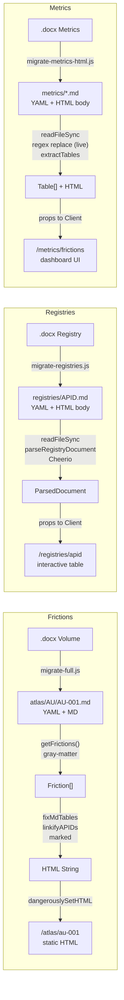

# Data Flow Diagram

Complete data flow from source document to rendered browser page for every content type.

```mermaid
flowchart TD
    subgraph AUTHOR["Author Actions"]
        AUTH1["Edit Human Friction\n.docx volume"]
        AUTH2["Create Pattern\n.docx file"]
        AUTH3["Edit Registry\n.docx"]
        AUTH4["Edit Metrics\n.docx"]
        AUTH5["Edit Governance\n.docx"]
    end

    subgraph MIG["Migration — tools/migration/"]
        MIG1["migrate-full.js\nMammoth HTML → Turndown MD\nSplit on APID anchors\nExtract metadata tables\nWrite frontmatter YAML"]
        MIG2["migrate-full.js\nSame script, pattern mode\nOne DOCX → One .md\nExtract PAT-ID from filename"]
        MIG3["migrate-registries.js\nMammoth → HTML\nPreserve table structure\nWrap in YAML frontmatter"]
        MIG4["migrate-metrics-html.js\nSame as registries\nHTML preserved for later parsing"]
        MIG5["migrate-docs.js\nMammoth → Clean Markdown\nHard-coded slug manifest\nflat frontmatter"]
    end

    subgraph DB["web/content/ — Content Database"]
        DB1["atlas/AU/AU-001.md\natlas/FF/FF-023.md\n≈375 files\nYAML + MD body"]
        DB2["patterns/PAT-001.md\n≈64 files\nYAML + MD body"]
        DB3["registries/APID-Registry.md\nYAML + HTML body"]
        DB4["metrics/human-friction-metrics.md\nYAML + HTML body"]
        DB5["docs/constitution.md\nYAML + MD body"]
    end

    subgraph LOAD["Data Access — api.ts / parsers"]
        LOAD1["getFrictions()\ngray-matter YAML parse\nNormalize apid, status\nDerive category_code"]
        LOAD2["getPatterns()\ngray-matter\nStrip non-ASCII from volume\nClean tags\nRegex fallbacks for fields"]
        LOAD3["fs.readFileSync()\nStrip frontmatter\nparseRegistryDocument()\nCheerio DOM extraction"]
        LOAD4["fs.readFileSync()\nStrip frontmatter\nRegex live interpolation\nextractTablesFromHtml()"]
        LOAD5["getDocs()\ngray-matter\nReturn slug+meta+content"]
    end

    subgraph RENDER["Build-time Rendering — app/**/*.tsx"]
        R1["fixMarkdownTables()\nlinkifyAPIDs()\nmarked.parse() → HTML\nJSX dossier layout"]
        R2["Same transformation\nPattern dossier layout\nRelated friction join"]
        R3["parseRegistryDocument data\n→ ApidRegistryClient props\nJSON-serialized"]
        R4["extractedTables + rawHtml\n→ FrictionDashboardClient\nJSON-serialized"]
        R5["fixMarkdownTables()\nmarked.parse() → HTML\nDoc prose layout"]
    end

    subgraph HTML_OUT["Static Output — web/out/"]
        O1["atlas/au-001/index.html\natlas/au/index.html\n(category + detail)"]
        O2["patterns/pat-001/index.html\npatterns/volume/v01/index.html"]
        O3["registries/apid/index.html\nregistries/category/index.html"]
        O4["metrics/frictions/index.html"]
        O5["docs/constitution/index.html"]
    end

    subgraph PF["Search — Pagefind"]
        PF1["npx pagefind --site out\nCrawl data-pagefind-body\nTokenize text content\nBuild binary index shards"]
        PF2["pagefind/\n.pf_index .pf_meta .pf_fragment"]
        PF3["copy-search.js\nout/pagefind → public/pagefind"]
    end

    subgraph BROWSER["Browser Runtime"]
        BR1["Friction Dossier\nStatic HTML\nZero hydration"]
        BR2["CategoryClient\nReact hydration\nFilter/sort state"]
        BR3["RegistryClient\nSearch + copy APID"]
        BR4["DashboardClient\nProgress bars + tables"]
        BR5["SearchModal\nDynamic import Pagefind\nCmd+K query interface"]
    end

    AUTH1 --> MIG1
    AUTH2 --> MIG2
    AUTH3 --> MIG3
    AUTH4 --> MIG4
    AUTH5 --> MIG5

    MIG1 --> DB1
    MIG2 --> DB2
    MIG3 --> DB3
    MIG4 --> DB4
    MIG5 --> DB5

    DB1 --> LOAD1
    DB2 --> LOAD2
    DB3 --> LOAD3
    DB4 --> LOAD4
    DB5 --> LOAD5

    LOAD1 --> R1
    LOAD2 --> R2
    LOAD3 --> R3
    LOAD4 --> R4
    LOAD5 --> R5

    R1 --> O1
    R2 --> O2
    R3 --> O3
    R4 --> O4
    R5 --> O5

    O1 --> PF1
    O2 --> PF1
    O3 --> PF1
    O4 --> PF1
    O5 --> PF1

    PF1 --> PF2
    PF2 --> PF3

    O1 --> BR1
    O1 --> BR2
    O3 --> BR3
    O4 --> BR4
    PF3 --> BR5

    style AUTHOR fill:#1a2a1a,stroke:#4ade80
    style MIG fill:#1a1a2a,stroke:#818cf8
    style DB fill:#2a1a1a,stroke:#f87171
    style LOAD fill:#1a2a2a,stroke:#22d3ee
    style RENDER fill:#2a2a1a,stroke:#fbbf24
    style HTML_OUT fill:#1a1a1a,stroke:#9ca3af
    style PF fill:#2a1a2a,stroke:#c084fc
    style BROWSER fill:#1a2a2a,stroke:#34d399
```

---

## Content Type Data Flow Summary

```mermaid
graph LR
    subgraph Frictions
        F1[".docx Volume"] -->|"migrate-full.js"| F2["atlas/AU/AU-001.md\nYAML + MD"]
        F2 -->|"getFrictions()\ngray-matter"| F3["Friction[]"]
        F3 -->|"fixMdTables\nlinkifyAPIDs\nmarked"| F4["HTML String"]
        F4 -->|"dangerouslySetHTML"| F5["/atlas/au-001\nstatic HTML"]
    end

    subgraph Registries
        R1[".docx Registry"] -->|"migrate-registries.js"| R2["registries/APID.md\nYAML + HTML body"]
        R2 -->|"readFileSync\nparseRegistryDocument\nCheerio"| R3["ParsedDocument"]
        R3 -->|"props to Client"| R4["/registries/apid\ninteractive table"]
    end

    subgraph Metrics
        M1[".docx Metrics"] -->|"migrate-metrics-html.js"| M2["metrics/*.md\nYAML + HTML body"]
        M2 -->|"readFileSync\nregex replace (live)\nextractTables"| M3["Table[] + HTML"]
        M3 -->|"props to Client"| M4["/metrics/frictions\ndashboard UI"]
    end
```
