# Parser Flow Diagram

How each parsing tier operates and transforms content.

```mermaid
flowchart TD
    subgraph TIER1["Tier 1 — Migration-Time Parsing\ntools/migration/*.js\nRuns once, manually triggered by developer"]
        
        subgraph T1_FRICTION["Friction Migration Path"]
            T1F_IN["DOCX volume file\nAU Volume 01.docx\n~25 frictions per volume"]
            T1F_MAMMOTH["mammoth.convertToHtml()\nDOCX binary → HTML string\nPreserves headings, bold, tables"]
            T1F_TURNDOWN["new TurndownService()\n.turndown(html)\nHTML → Markdown\nheadingStyle: 'atx'\ncodeBlockStyle: 'fenced'"]
            T1F_SPLIT["Split on APID anchors\nRegex: /^## (AU|DW|...)-\\d{3}/m\nOne block per friction"]
            T1F_META["Extract metadata table\nCategory, Subcategory\nObservation Level, Status\nTags, Version, UUID"]
            T1F_YAML["Build YAML frontmatter\nidentity.id = 'AU-001'\nidentity.uuid = 'urn:uuid:...'\nmetadata.title = extracted\nevidence.observation_level = int"]
            T1F_WRITE["fs.writeFileSync()\nweb/content/atlas/AU/AU-001.md\nFrontmatter + body markdown"]

            T1F_IN --> T1F_MAMMOTH
            T1F_MAMMOTH --> T1F_TURNDOWN
            T1F_TURNDOWN --> T1F_SPLIT
            T1F_SPLIT --> T1F_META
            T1F_META --> T1F_YAML
            T1F_YAML --> T1F_WRITE
        end

        subgraph T1_REGISTRY["Registry Migration Path"]
            T1R_IN["Registry DOCX\nAPID-Registry.docx"]
            T1R_MAMMOTH["mammoth.convertToHtml()\nHTML PRESERVED\nNo Turndown conversion"]
            T1R_SANITIZE["Sanitize Unicode\nReplace \\u201C \\u201D (curly quotes)\nReplace \\u2014 (em-dash)"]
            T1R_WRAP["Prepend YAML frontmatter\ntitle: APID Registry\nslug: apid-registry"]
            T1R_WRITE["Write APID-Registry.md\n--- frontmatter ---\n<html>...</html>"]

            T1R_IN --> T1R_MAMMOTH
            T1R_MAMMOTH --> T1R_SANITIZE
            T1R_SANITIZE --> T1R_WRAP
            T1R_WRAP --> T1R_WRITE
        end

        subgraph T1_PATTERN["Pattern Migration Path"]
            T1P_IN["Pattern DOCX\nPAT-001 — Context Loss.docx\nOne file per pattern"]
            T1P_MAMMOTH["mammoth.convertToHtml()\nthen Turndown → Markdown"]
            T1P_EXTRACT["Extract from markdown body\nPAT-ID from filename\nTitle, Volume, Tags via regex\nrelated_apids via regex\nStatus via regex"]
            T1P_YAML["Build YAML frontmatter\nidentity.id = 'PAT-001'\nmetadata.volume = 'Volume 01 — ...'"]
            T1P_WRITE["Write PAT-001.md\nweb/content/patterns/PAT-001.md"]

            T1P_IN --> T1P_MAMMOTH
            T1P_MAMMOTH --> T1P_EXTRACT
            T1P_EXTRACT --> T1P_YAML
            T1P_YAML --> T1P_WRITE
        end
    end

    subgraph TIER2["Tier 2 — Runtime Document Parsing\nweb/src/lib/api.ts\nRuns on every next build"]
        
        subgraph T2_GRAY["Frontmatter Parsing"]
            T2_READ["fs.readFileSync(file, 'utf8')"]
            T2_MATTER["gray-matter(rawContent)\nSplits on --- delimiters\nParses YAML header"]
            T2_DATA["{ data: frontmatter, content: body }"]

            T2_READ --> T2_MATTER
            T2_MATTER --> T2_DATA
        end

        subgraph T2_NORM["Normalization Fallbacks"]
            T2_APID["identity.apid = apid || id\nEnsure APID field exists"]
            T2_CODE["category_code = apid.split('-')[0]\nDerive domain code from ID"]
            T2_STATUS["metadata.status = status || 'draft'\nDefault if missing"]
            T2_LEVEL["observation_level = parseInt(level)\nDefault: 4 if invalid"]
            T2_VOL["volume = vol.replace(/[^\\x00-\\x7F]/g, '-')\nStrip em-dashes from volume names"]
            T2_TAGS["tags.map(t => t.replace(/^\\*\\*Tags:\\*\\*\\s*/, ''))\nStrip Turndown bold markers"]

            T2_DATA --> T2_APID
            T2_APID --> T2_CODE
            T2_CODE --> T2_STATUS
            T2_STATUS --> T2_LEVEL
            T2_LEVEL --> T2_VOL
            T2_VOL --> T2_TAGS
        end

        subgraph T2_MARKUP["Markup Transformation (in page.tsx)"]
            T2_FIX["fixMarkdownTables(content)\nScan for table header lines\nInsert missing |---|---| rows\nCompensates for Turndown artifact"]
            T2_LINK["linkifyAPIDs(content)\nRegex: /(?<!\\[)\\b([A-Z]{2,3}-\\d{3})\\b(?!\\])/g\nAU-001 → [AU-001](/atlas/au-001)\nPAT-001 → [PAT-001](/patterns/pat-001)"]
            T2_MARKED["marked.parse(content)\nMarkdown → HTML string\nDefault renderer\nStandard HTML output"]
            T2_INJECT["dangerouslySetInnerHTML\n{ __html: htmlString }"]

            T2_TAGS --> T2_FIX
            T2_FIX --> T2_LINK
            T2_LINK --> T2_MARKED
            T2_MARKED --> T2_INJECT
        end
    end

    subgraph TIER3["Tier 3 — Runtime Structure Parsing\nweb/src/lib/registryParser.ts + tableParser.ts\nRuns on every next build, only for registries/metrics"]

        subgraph T3_CHEERIO["Registry Parsing (registryParser.ts)"]
            T3_LOAD["cheerio.load(html)\nCreate jQuery-like $ object"]
            T3_PARAS["$('p').each()\n→ intro[] paragraphs"]
            T3_TABLES["$('table').each()\nIterate all tables by index"]
            T3_HEADERS["$(table).find('th')\n.map((_, th) => $(th).text())\n→ headers[]"]
            T3_ROWS["$(table).find('tbody tr')\n.map() each row\n.find('td') each cell\n→ rows[][]"]
            T3_DETECT["detectTableType(headers)\nSignature-based detection:\n'APID' + 'Human Friction' → friction\n'Category ID' + 'Prefix' → category\n'PTID' or 'PAT' → pattern"]
            T3_ENTRIES["Build typed RegistryEntry[]\nApidEntry | CategoryEntry | PatternEntry"]
            T3_RULES["$('ol li').each()\n→ rules[]"]

            T3_LOAD --> T3_PARAS
            T3_LOAD --> T3_TABLES
            T3_TABLES --> T3_HEADERS
            T3_HEADERS --> T3_DETECT
            T3_TABLES --> T3_ROWS
            T3_ROWS --> T3_DETECT
            T3_DETECT --> T3_ENTRIES
            T3_LOAD --> T3_RULES
        end

        subgraph T3_REGEX["Metrics Parsing (tableParser.ts)"]
            T3_INTERP["Live interpolation first:\n/>375</ → live friction count\n/>37.5%</ → live completion %\nDone in Server Component\nbefore calling parser"]
            T3_TABLE_REGEX["/<table[\\s\\S]*?<\\/table>/gi\nMatch all table elements"]
            T3_TH["/<th[^>]*>([\\s\\S]*?)<\\/th>/gi\nExtract header text\nStrip inner HTML tags"]
            T3_TD["/<td[^>]*>([\\s\\S]*?)<\\/td>/gi\nExtract cell text\nStrip inner HTML tags"]
            T3_STRUCT["Build Table[]\n[{ headers: string[], rows: string[][] }]"]

            T3_INTERP --> T3_TABLE_REGEX
            T3_TABLE_REGEX --> T3_TH
            T3_TABLE_REGEX --> T3_TD
            T3_TH --> T3_STRUCT
            T3_TD --> T3_STRUCT
        end
    end

    T1F_WRITE --> T2_READ
    T1R_WRITE --> T3_LOAD
    T1P_WRITE --> T2_READ

    style TIER1 fill:#1a2a1a,stroke:#4ade80
    style TIER2 fill:#1a1a2a,stroke:#818cf8
    style TIER3 fill:#2a1a1a,stroke:#f87171
    style T1_FRICTION fill:#142214,stroke:#4ade80
    style T1_REGISTRY fill:#141422,stroke:#818cf8
    style T1_PATTERN fill:#221414,stroke:#f87171
    style T2_GRAY fill:#141422,stroke:#818cf8
    style T2_NORM fill:#181822,stroke:#818cf8
    style T2_MARKUP fill:#1c1c28,stroke:#818cf8
    style T3_CHEERIO fill:#221414,stroke:#f87171
    style T3_REGEX fill:#221c14,stroke:#fbbf24
```

---

## Known Parser Artifacts and Mitigations

| Artifact | Source | Detection | Mitigation |
|----------|--------|-----------|------------|
| Missing table separator row `|---|---|` | Turndown sometimes omits separator | Check next line after table header | `fixMarkdownTables()` inserts it |
| `**Tags:** cognitive-load` prefix | Turndown converts `<strong>Tags:</strong>` literally | Tags starting with `**` | `getPatterns()` strips prefix |
| Em-dash `—` in volume names | Word uses Unicode em-dash | Non-ASCII chars in volume names | `replace(/[^\x00-\x7F]/g, '-')` |
| Curly quotes `"` `"` | Word autocorrects straight quotes | Unicode range 0x201C–0x201D | Migration scripts regex-replace |
| Bare APID references in prose | Researchers write `AU-001` not `[AU-001](/...)` | Pattern `/\b[A-Z]{2,3}-\d{3}\b/` | `linkifyAPIDs()` converts them |
| Missing frontmatter fields | Incomplete migration extraction | Field is `undefined` | `api.ts` normalization with defaults |
