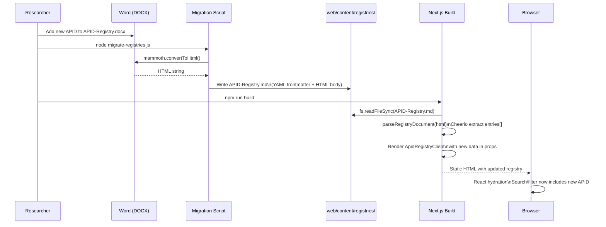

# Registry Flow Diagram

How registry data flows from source DOCX to interactive browser tables.

```mermaid
flowchart TD
    subgraph SOURCE["Source Documents — atlas/Registries/"]
        APID_DOCX["APID-Registry.docx\nMicrosoft Word table\n~375 rows\n[ID, Title, Status, Category]"]
        CAT_DOCX["Category-Registry.docx\nMicrosoft Word table\n8+ rows\n[ID, Prefix, Title, Domain, Status]"]
        PAT_DOCX["Pattern-Registry.docx\nMicrosoft Word table\n~64 rows\n[ID, Title, Status, Volume]"]
    end

    subgraph MIGRATION["Migration — tools/migration/migrate-registries.js"]
        MAMMOTH["mammoth.convertToHtml({ path })\nPreserve table HTML structure\nDo NOT use Turndown\n(would corrupt tables)"]
        SANITIZE["Sanitize Unicode\nReplace curly quotes\nReplace em-dashes"]
        WRAP["Add YAML frontmatter\ntitle, slug, source"]
        WRITE["Write .md file\nFrontmatter + HTML body\n(hybrid format)"]
    end

    subgraph CONTENT_DB["Content Database — web/content/registries/"]
        APID_MD["APID-Registry.md\n---\ntitle: APID Registry\nslug: apid-registry\n---\n<html>...</html>"]
        CAT_MD["Category-Registry.md\n---\ntitle: Category Registry\nslug: category-registry\n---\n<html>...</html>"]
        PAT_MD["Pattern-Registry.md\n---\ntitle: Pattern Registry\nslug: pattern-registry\n---\n<html>...</html>"]
    end

    subgraph SERVER_COMP["Server Components — web/src/app/registries/"]
        APID_PAGE["apid/page.tsx\nfs.readFileSync(APID-Registry.md)\nStrip frontmatter\n→ raw HTML string"]
        CAT_PAGE["category/page.tsx\nfs.readFileSync(Category-Registry.md)\nStrip frontmatter"]
        PAT_PAGE["pattern/page.tsx\nfs.readFileSync(Pattern-Registry.md)\nStrip frontmatter"]
    end

    subgraph PARSER["Parser — web/src/lib/registryParser.ts"]
        LOAD_CHEERIO["cheerio.load(html)\nBuild DOM from HTML string"]
        INTRO["$('p').each()\n→ intro[]"]
        FIELDS["Table 0: Registry Fields\n→ fields[] { field, description }"]
        STATS["Table 1: Registry Statistics\n→ statistics {} key-value"]
        DOCINFO["Table 2: Document Information\n→ docInfo {} key-value"]
        RULES["$('ol li').each()\n→ rules[]"]
        
        subgraph DETECT["Entry Table Detection"]
            CHECK_HEADERS["Read table <th> headers"]
            IS_APID{{"headers contains\n'APID' AND\n'Human Friction'?"}}
            IS_CAT_DETECT{{"headers contains\n'Category ID' AND\n'Prefix'?"}}
            IS_PAT_DETECT{{"headers contains\n'PTID' or 'PAT'?"}}
            
            CHECK_HEADERS --> IS_APID
            IS_APID -->|Yes| PARSE_APID_ENTRIES["Parse as ApidEntry[]\n{ id, title, status, category }"]
            IS_APID -->|No| IS_CAT_DETECT
            IS_CAT_DETECT -->|Yes| PARSE_CAT_ENTRIES["Parse as CategoryEntry[]\n{ id, prefix, title, domain, status }"]
            IS_CAT_DETECT -->|No| IS_PAT_DETECT
            IS_PAT_DETECT -->|Yes| PARSE_PAT_ENTRIES["Parse as PatternEntry[]\n{ id, title, status, volume }"]
            IS_PAT_DETECT -->|No| SKIP["Skip table\n(unknown type)"]
        end
        
        LOAD_CHEERIO --> INTRO
        LOAD_CHEERIO --> FIELDS
        LOAD_CHEERIO --> STATS
        LOAD_CHEERIO --> DOCINFO
        LOAD_CHEERIO --> RULES
        LOAD_CHEERIO --> CHECK_HEADERS
    end

    subgraph PARSED_DOC["ParsedDocument Object"]
        RESULT["{\n  intro: string[],\n  fields: [{field, description}],\n  statistics: {key: value},\n  docInfo: {key: value},\n  rules: string[],\n  entries: RegistryEntry[]\n}"]
    end

    subgraph CLIENT_COMP["Client Components — web/src/components/"]
        APID_CLIENT["ApidRegistryClient\nProps: { data: ParsedDocument }\nFeatures:\n- Text search (ID + title + category)\n- Category filter dropdown\n- Status filter\n- Sort: APID numerical / title\n- Click-to-copy APID\n- Entry count display"]
        CAT_CLIENT["CategoryRegistryClient\nProps: { data: ParsedDocument }\nFeatures:\n- Text search (code + title + domain)\n- Status filter\n- Sort: ID / title\n- Click-to-copy prefix"]
        PAT_CLIENT["PatternRegistryClient\nProps: { data: ParsedDocument }\nFeatures:\n- Text search (PAT-ID + title + volume)\n- Volume filter dropdown\n- Status filter\n- Sort: PAT number / title\n- Click-to-copy PAT-ID"]
    end

    APID_DOCX --> MAMMOTH
    CAT_DOCX --> MAMMOTH
    PAT_DOCX --> MAMMOTH
    MAMMOTH --> SANITIZE
    SANITIZE --> WRAP
    WRAP --> WRITE
    WRITE --> APID_MD
    WRITE --> CAT_MD
    WRITE --> PAT_MD

    APID_MD --> APID_PAGE
    CAT_MD --> CAT_PAGE
    PAT_MD --> PAT_PAGE

    APID_PAGE --> LOAD_CHEERIO
    CAT_PAGE --> LOAD_CHEERIO
    PAT_PAGE --> LOAD_CHEERIO

    PARSE_APID_ENTRIES --> RESULT
    PARSE_CAT_ENTRIES --> RESULT
    PARSE_PAT_ENTRIES --> RESULT
    INTRO --> RESULT
    FIELDS --> RESULT
    STATS --> RESULT
    DOCINFO --> RESULT
    RULES --> RESULT

    RESULT -->|"props"| APID_CLIENT
    RESULT -->|"props"| CAT_CLIENT
    RESULT -->|"props"| PAT_CLIENT

    style SOURCE fill:#1a2a1a,stroke:#4ade80
    style MIGRATION fill:#1a1a2a,stroke:#818cf8
    style CONTENT_DB fill:#2a1a1a,stroke:#f87171
    style SERVER_COMP fill:#2a2a1a,stroke:#fbbf24
    style PARSER fill:#1a2a2a,stroke:#22d3ee
    style DETECT fill:#1f1f2a,stroke:#818cf8
    style PARSED_DOC fill:#1a1a1a,stroke:#9ca3af
    style CLIENT_COMP fill:#2a1a2a,stroke:#c084fc
```

---

## Registry Update Cycle

```mermaid
sequenceDiagram
    participant R as Researcher
    participant W as Word (DOCX)
    participant S as Migration Script
    participant DB as web/content/registries/
    participant B as Next.js Build
    participant BR as Browser

    R->>W: Add new APID to APID-Registry.docx
    R->>S: node migrate-registries.js
    S->>W: mammoth.convertToHtml()
    W-->>S: HTML string
    S->>DB: Write APID-Registry.md\n(YAML frontmatter + HTML body)
    R->>B: npm run build
    B->>DB: fs.readFileSync(APID-Registry.md)
    B->>B: parseRegistryDocument(html)\nCheerio extract entries[]
    B->>B: Render ApidRegistryClient\nwith new data in props
    B-->>BR: Static HTML with updated registry
    BR->>BR: React hydration\nSearch/filter now includes new APID
```
