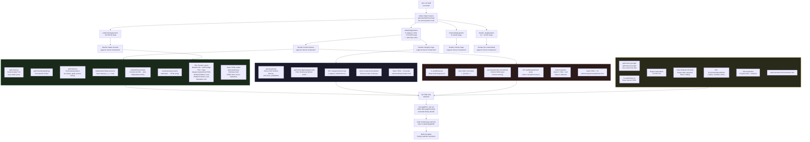
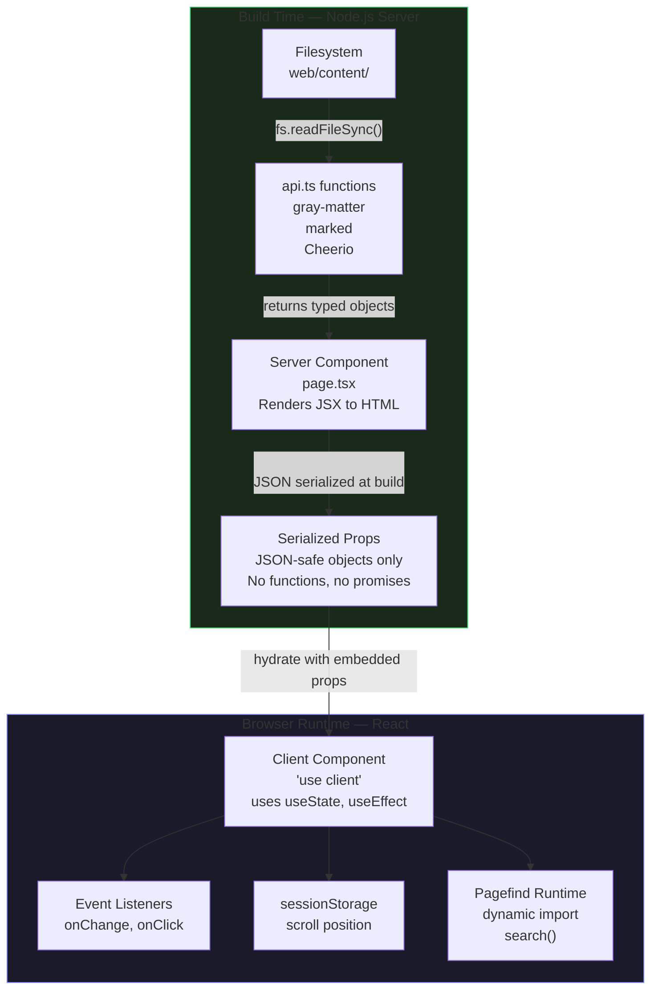

# Render Flow Diagram

How the Next.js build engine renders each page type from content to HTML.

```mermaid
flowchart TD
    START["npm run build\nnext build"]
    
    START --> COLLECT["Collect Static Params\ngenerateStaticParams()\nfor each dynamic route"]

    COLLECT --> ATLAS_PARAMS["atlas/[slug] params\n8 category codes\n~375 APID slugs\n= ~383 total routes"]
    COLLECT --> PAT_PARAMS["patterns/[slug] params\n~64 PAT-ID slugs"]
    COLLECT --> VOL_PARAMS["volume/[slug] params\nN volume slugs"]
    COLLECT --> DOC_PARAMS["docs/[[...slug]] params\n[] + ~19 doc slugs"]

    ATLAS_PARAMS --> RENDER_FRICTION["Render Friction Dossier\npage.tsx Server Component"]
    ATLAS_PARAMS --> RENDER_CAT["Render Category Page\npage.tsx Server Component"]
    PAT_PARAMS --> RENDER_PAT["Render Pattern Dossier\npage.tsx Server Component"]
    VOL_PARAMS --> RENDER_VOL["Render Volume Page\npage.tsx Server Component"]
    DOC_PARAMS --> RENDER_DOC["Render Doc Index/Detail\npage.tsx Server Component"]

    subgraph FRICTION_FLOW["Friction Dossier Render Pipeline"]
        RF1["getFrictions()\nRead all atlas/*.md\ngray-matter parse"]
        RF2["getFrictionByApid(slug)\nFind specific friction"]
        RF3["getPatterns()\nFind related patterns\nby related_apids reverse lookup"]
        RF4["fixMarkdownTables(content)\nInsert missing |---|---| rows"]
        RF5["linkifyAPIDs(content)\nConvert AU-001 → [AU-001](/atlas/au-001)"]
        RF6["marked.parse(content)\nMarkdown → HTML string"]
        RF7["JSX: Dossier Layout\nBreadcrumb + APID badge\nTitle + Tags\ndangerouslySetInnerHTML\nRelated Patterns card\nRelated Frictions card\nMetadata card"]
        RF8["Static HTML output\nweb/out/atlas/au-001/index.html\nZERO client JS (no hydration)"]

        RF1 --> RF2
        RF2 --> RF3
        RF3 --> RF4
        RF4 --> RF5
        RF5 --> RF6
        RF6 --> RF7
        RF7 --> RF8
    end

    subgraph CATEGORY_FLOW["Category Page Render Pipeline"]
        RC1["getCategories()\nDerive from frictions\nFilter by OFFICIAL_DOMAINS"]
        RC2["getFrictionsByCategory(code)\nFilter frictions by domain prefix"]
        RC3["JSX: CategoryClient props\n{ category, initialFrictions }"]
        RC4["Client Component hydration\nFilter/sort state in browser"]
        RC5["Static HTML + JS bundle\nweb/out/atlas/au/index.html"]

        RC1 --> RC2
        RC2 --> RC3
        RC3 --> RC4
        RC4 --> RC5
    end

    subgraph REGISTRY_FLOW["Registry Page Render Pipeline"]
        RR1["fs.readFileSync()\nRead APID-Registry.md"]
        RR2["Strip YAML frontmatter\n/---[\\s\\S]*?---/"]
        RR3["parseRegistryDocument(html)\nCheerio DOM parse\nExtract entries[]"]
        RR4["JSX: ApidRegistryClient props\n{ data: ParsedDocument }"]
        RR5["Client hydration\nSearch + filter + sort\nCopy to clipboard"]
        RR6["Static HTML + JS\nweb/out/registries/apid/index.html"]

        RR1 --> RR2
        RR2 --> RR3
        RR3 --> RR4
        RR4 --> RR5
        RR5 --> RR6
    end

    subgraph METRICS_FLOW["Metrics Page Render Pipeline"]
        RM1["getFrictions().length\ngetPatterns().length\nLive counts from disk"]
        RM2["fs.readFileSync()\nRead metrics HTML"]
        RM3["Regex interpolation\n/>375</ → live count\n/>37.5%</ → live percent"]
        RM4["extractTablesFromHtml()\nRegex table extraction\nReturn Table[]"]
        RM5["JSX: FrictionDashboardClient\n{ tables, rawHtml, totals }"]
        RM6["Client hydration\nProgress bars + analytics"]
        RM7["web/out/metrics/frictions/index.html"]

        RM1 --> RM3
        RM2 --> RM3
        RM3 --> RM4
        RM4 --> RM5
        RM5 --> RM6
        RM6 --> RM7
    end

    RENDER_FRICTION --> FRICTION_FLOW
    RENDER_CAT --> CATEGORY_FLOW
    RENDER_FRICTION --> REGISTRY_FLOW
    RENDER_PAT --> FRICTION_FLOW

    ALL_HTML["All HTML files\nweb/out/"] 
    
    FRICTION_FLOW --> ALL_HTML
    CATEGORY_FLOW --> ALL_HTML
    REGISTRY_FLOW --> ALL_HTML
    METRICS_FLOW --> ALL_HTML

    ALL_HTML --> PAGEFIND["npx pagefind --site out\nIndex data-pagefind-body\nGenerate binary shards"]
    PAGEFIND --> COPY["node scripts/copy-search.js\nSync to public/pagefind/"]
    COPY --> DONE["Build Complete\nDeploy web/out/ anywhere"]

    style FRICTION_FLOW fill:#1a2a1a,stroke:#4ade80
    style CATEGORY_FLOW fill:#1a1a2a,stroke:#818cf8
    style REGISTRY_FLOW fill:#2a1a1a,stroke:#f87171
    style METRICS_FLOW fill:#2a2a1a,stroke:#fbbf24
```

---

## The Server/Client Boundary

```mermaid
graph TB
    subgraph BUILD_TIME["Build Time — Node.js Server"]
        FS["Filesystem\nweb/content/"]
        API_FN["api.ts functions\ngray-matter\nmarked\nCheerio"]
        SERVER_COMP["Server Component\npage.tsx\nRenders JSX to HTML"]
        SERIAL["Serialized Props\nJSON-safe objects only\nNo functions, no promises"]
    end

    subgraph BROWSER_TIME["Browser Runtime — React"]
        CLIENT_COMP["Client Component\n'use client'\nuses useState, useEffect"]
        EVENTS["Event Listeners\nonChange, onClick"]
        SESSIONSTORAGE["sessionStorage\nscroll position"]
        PAGEFIND_RT["Pagefind Runtime\ndynamic import\nsearch()"]
    end

    FS -->|"fs.readFileSync()"| API_FN
    API_FN -->|"returns typed objects"| SERVER_COMP
    SERVER_COMP -->|"<ClientComp prop={data} />\nJSON serialized at build"| SERIAL
    SERIAL -->|"hydrate with embedded props"| CLIENT_COMP
    CLIENT_COMP --> EVENTS
    CLIENT_COMP --> SESSIONSTORAGE
    CLIENT_COMP --> PAGEFIND_RT

    style BUILD_TIME fill:#1a2a1a,stroke:#4ade80
    style BROWSER_TIME fill:#1a1a2a,stroke:#818cf8
```
