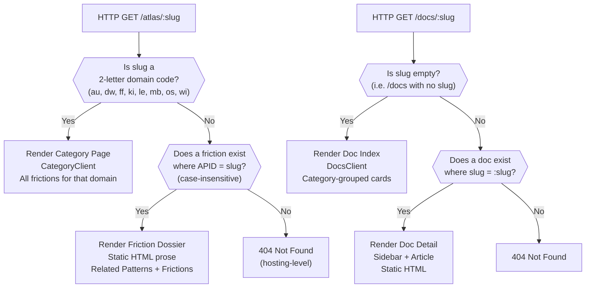

# Routing Diagram

Complete URL structure and route mapping for the UIL web application.

```mermaid
graph TD
    ROOT["/\nHomepage\nLive stats + domain grid\n+ featured content"]

    ROOT --> ATLAS["/atlas\nAtlas Explorer\nDomain card grid\n8 categories"]
    ROOT --> PATTERNS["/patterns\nPatterns Index\nVolume cards or PAT-ID list"]
    ROOT --> DOCS["/docs\nDocs Index\nCategory-grouped cards"]
    ROOT --> METRICS["/metrics\nMetrics Overview\n2 section cards"]
    ROOT --> REGISTRIES["/registries\nRegistries Overview\n3 colored cards"]

    subgraph ATLAS_TREE["/atlas routes"]
        ATLAS --> ATLAS_CAT["/atlas/:code\ne.g. /atlas/au\nCategory list of frictions\nCategoryClient\nAll AU frictions"]
        ATLAS --> ATLAS_APID["/atlas/:apid\ne.g. /atlas/au-001\nFriction Dossier\nStatic SSR"]

        ATLAS_CAT --> AU["/atlas/au\nAuthentication & Forms"]
        ATLAS_CAT --> DW["/atlas/dw\nDesktop Workspace"]
        ATLAS_CAT --> FF["/atlas/ff\nFiles & Project Mgmt"]
        ATLAS_CAT --> KI["/atlas/ki\nKeyboard & Input"]
        ATLAS_CAT --> LE["/atlas/le\nLearning & Cognition"]
        ATLAS_CAT --> MB["/atlas/mb\nMobile Experience"]
        ATLAS_CAT --> OS["/atlas/os\nDesktop & OS"]
        ATLAS_CAT --> WI["/atlas/wi\nWeb & Internet"]

        ATLAS_APID --> AU001["/atlas/au-001 ... au-050"]
        ATLAS_APID --> DW001["/atlas/dw-001 ... dw-0NN"]
        ATLAS_APID --> FF001["/atlas/ff-001 ... ff-0NN\n...etc for all 8 domains"]
    end

    subgraph PAT_TREE["/patterns routes"]
        PATTERNS --> PAT_DETAIL["/patterns/:ptid\ne.g. /patterns/pat-001\nPattern Dossier\nStatic SSR"]
        PATTERNS --> PAT_VOL["/patterns/volume/:slug\ne.g. /patterns/volume/volume-01-cognitive-behaviour\nVolume group page\nVolumeClient"]

        PAT_DETAIL --> PAT001["/patterns/pat-001 ... pat-064"]
        PAT_VOL --> VOL1["/patterns/volume/volume-01..."]
        PAT_VOL --> VOL2["/patterns/volume/volume-02..."]
        PAT_VOL --> VOLN["/patterns/volume/... (one per volume)"]
    end

    subgraph DOC_TREE["/docs routes"]
        DOCS --> DOC_DETAIL["/docs/:slug\ne.g. /docs/constitution\nDoc prose page\nSidebar + Article layout\nStatic SSR"]

        DOC_DETAIL --> CONST["/docs/constitution"]
        DOC_DETAIL --> BRAND["/docs/brand-book"]
        DOC_DETAIL --> PUB["/docs/publishing-manual"]
        DOC_DETAIL --> ETC["...~19 doc pages"]
    end

    subgraph MET_TREE["/metrics routes"]
        METRICS --> MET_F["/metrics/frictions\nFriction analytics dashboard\nLive-interpolated stats\nFrictionDashboardClient"]
        METRICS --> MET_P["/metrics/patterns\nPattern analytics dashboard\nLive-interpolated stats\nPatternDashboardClient"]
    end

    subgraph REG_TREE["/registries routes"]
        REGISTRIES --> REG_APID["/registries/apid\nAPID Registry\nApidRegistryClient\nAll ~375 APIDs"]
        REGISTRIES --> REG_CAT["/registries/category\nCategory Registry\nCategoryRegistryClient\n8 official categories"]
        REGISTRIES --> REG_PAT["/registries/pattern\nPattern Registry\nPatternRegistryClient\nAll ~64 patterns"]
        REGISTRIES --> REG_FALL["/registries/:slug\nFallback prose render\nfor other registry files"]
    end

    style ATLAS_TREE fill:#1a2a1a,stroke:#4ade80
    style PAT_TREE fill:#1a1a2a,stroke:#818cf8
    style DOC_TREE fill:#2a2a1a,stroke:#fbbf24
    style MET_TREE fill:#2a1a2a,stroke:#c084fc
    style REG_TREE fill:#2a1a1a,stroke:#f87171
```

---

## Route Resolution Rules

---

## URL Convention Reference

| URL Pattern | Content Type | Example | Notes |
|-------------|-------------|---------|-------|
| `/atlas` | Atlas Explorer | `/atlas` | Fixed |
| `/atlas/:code` | Domain category | `/atlas/au` | Code is 2 lowercase letters |
| `/atlas/:apid` | Friction dossier | `/atlas/au-001` | APID is 2-letters + dash + 3 digits |
| `/patterns` | Patterns index | `/patterns` | Fixed |
| `/patterns/:ptid` | Pattern dossier | `/patterns/pat-001` | PTID is `pat-` + 3 digits |
| `/patterns/volume/:slug` | Volume group | `/patterns/volume/volume-01-cognitive-behaviour` | Derived from volume name |
| `/docs` | Docs index | `/docs` | Fixed (catch-all with empty slug) |
| `/docs/:slug` | Doc detail | `/docs/constitution` | From frontmatter `slug` field |
| `/metrics` | Metrics overview | `/metrics` | Fixed |
| `/metrics/frictions` | Friction dashboard | `/metrics/frictions` | Fixed |
| `/metrics/patterns` | Pattern dashboard | `/metrics/patterns` | Fixed |
| `/registries` | Registries overview | `/registries` | Fixed |
| `/registries/apid` | APID Registry | `/registries/apid` | Fixed |
| `/registries/category` | Category Registry | `/registries/category` | Fixed |
| `/registries/pattern` | Pattern Registry | `/registries/pattern` | Fixed |
